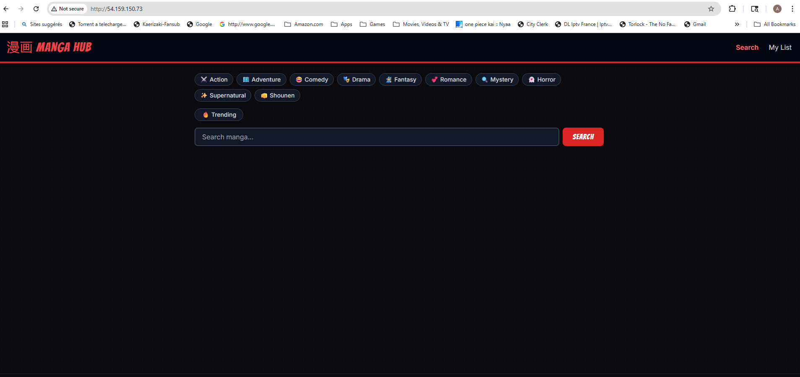
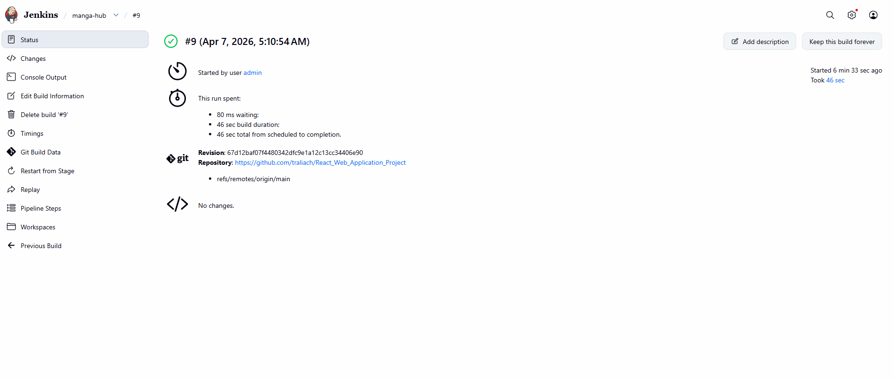
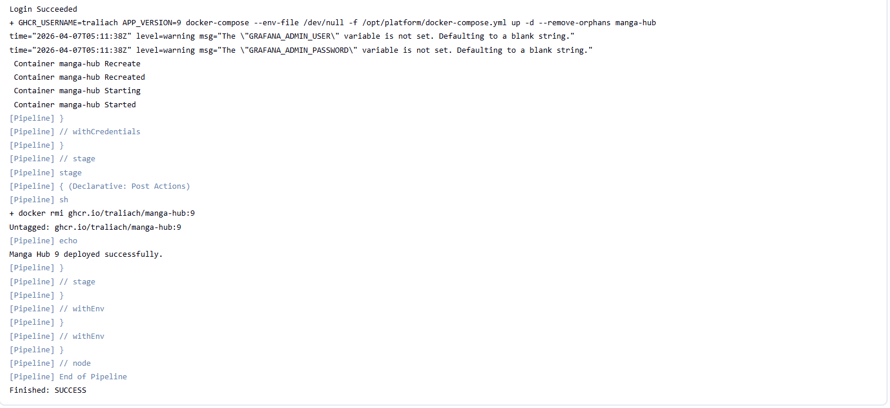
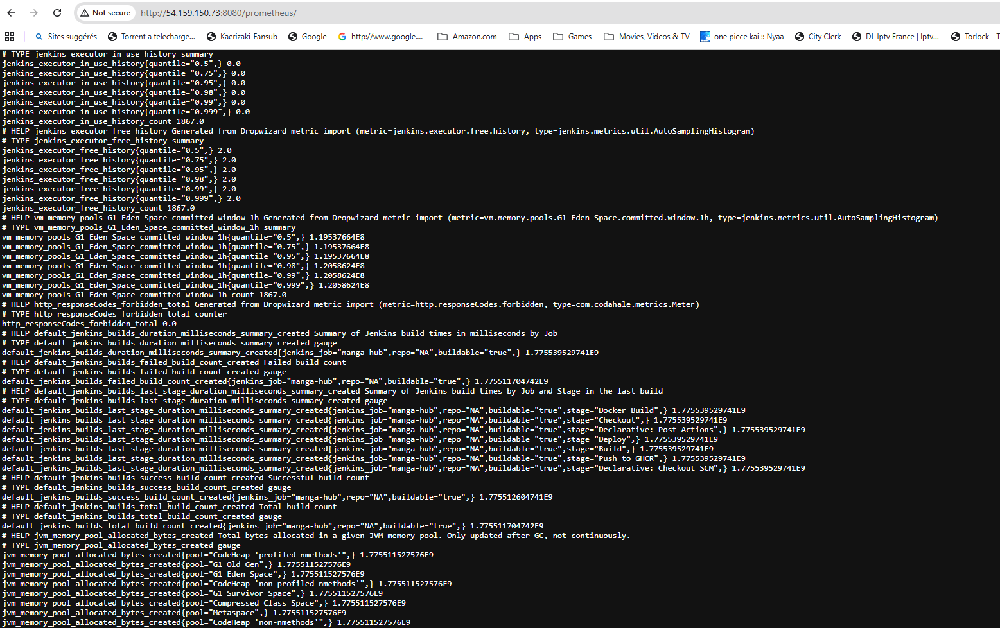
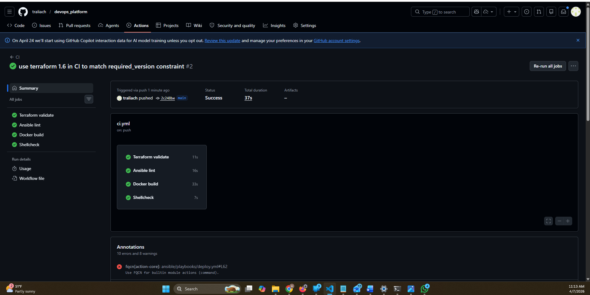

# devops_platform

> Self-hosted DevOps platform on AWS EC2 — Jenkins CI/CD, Prometheus, Grafana, deployed via Docker Compose, provisioned with Terraform, configured with Ansible.


## Screenshots

### Manga Hub — Live on EC2


### Jenkins Pipeline — All Stages Green


### Jenkins Build #9 — Success in 46s


### Jenkins Console Output — Finished: SUCCESS


### Jenkins Metrics Endpoint — Live Pipeline Data


### GitHub Actions CI — All Jobs Green


## Overview

A fully automated, self-hosted DevOps platform built as a portfolio project. It provisions an AWS EC2 instance with Terraform, configures it with Ansible, and runs a Docker Compose stack containing:

- **Jenkins LTS** — CI/CD pipeline that builds, pushes, and deploys the Manga Hub React app
- **Prometheus** — metrics scraping from Jenkins
- **Grafana** — dashboards fed by Prometheus
- **Manga Hub** — a React + TypeScript SPA served via Nginx, built and deployed by Jenkins

Every push to the [Manga Hub repo](https://github.com/traliach/React_Web_Application_Project) triggers a Jenkins pipeline that builds the Docker image, pushes it to GHCR, and redeploys the container on EC2 — all within ~60 seconds.

## Architecture

```
Developer pushes to GitHub
         │
         ▼
Jenkins (port 8080)
  ├── Checkout source from GitHub
  ├── Build React app (node:20-alpine)
  ├── Build Docker image (multi-stage: Node → Nginx)
  ├── Push to GHCR (ghcr.io/traliach/manga-hub)
  └── Deploy container on EC2 (port 80)

AWS EC2 t3.small (us-east-1)
  ├── Provisioned by Terraform
  │     └── VPC, subnet, security group, Elastic IP, IAM role (SSM)
  ├── Configured by Ansible
  │     └── Docker, swap, sysctl, deploy user, firewalld
  └── Docker Compose stack
        ├── jenkins       → :8080
        ├── prometheus    → :9090 (internal)
        ├── grafana       → :3000
        └── manga-hub     → :80

Access: AWS SSM Session Manager (no SSH key, no port 22)
Registry: GHCR (ghcr.io/traliach/manga-hub)
Secrets: /opt/platform/.env (root:root 600, never committed)
```

## Stack

| Tool | Version | Purpose |
|------|---------|---------|
| Terraform | ~> 5.0 (AWS provider) | EC2 provisioning, S3 state backend, DynamoDB lock |
| Ansible | latest (community.aws) | Server configuration via SSM connection |
| Docker Compose | v2 | Container orchestration on EC2 |
| Jenkins | LTS (jdk21) | CI/CD — builds and deploys Manga Hub |
| Prometheus | v2.51.2 | Metrics collection |
| Grafana | 10.4.2 | Dashboards |
| Jenkins JCasC | latest | Jenkins configured entirely as code |

## Repository structure

```
devops_platform/
├── infra/                  # Terraform — EC2, VPC, IAM, Elastic IP
├── ansible/
│   ├── playbooks/          # provision.yml, deploy.yml
│   ├── roles/              # common, docker, users, firewall
│   └── inventory/
├── platform/
│   ├── docker-compose.yml  # Full stack definition
│   ├── jenkins/
│   │   ├── Dockerfile      # Jenkins LTS + docker CLI + plugins
+  │   │   ├── plugins.txt   # Plugin list (unpinned — resolved at build time)
│   │   └── casc/
│   │       └── jenkins.yaml # Full JCasC config — security, credentials, env
│   ├── prometheus/
│   │   └── prometheus.yml
│   └── grafana/
│       ├── provisioning/
│       └── dashboards/
├── app/                    # Cloned from React_Web_Application_Project
│   ├── Dockerfile          # Multi-stage: Node 20 build → Nginx alpine serve
│   ├── nginx.conf          # SPA routing (try_files for React Router)
│   └── Jenkinsfile         # Declarative pipeline
├── scripts/
│   └── check-jenkins.sh    # One-shot SSM health check script
├── docs/
│   └── runbook.md          # Full build log — private, gitignored
└── Makefile                # Wraps all deploy commands
```

## Prerequisites

- AWS CLI configured (`us-east-1`)
- Terraform >= 1.5
- Ansible + `community.aws` collection (run from WSL/Linux — not Windows)
- Docker (local, for testing builds)
- A GitHub PAT with `write:packages` scope (for GHCR push)

> **Windows users:** Run all Ansible and Make commands from WSL2. Ansible does not support Windows as a control node.

## Quick start

```bash
# 1. Clone
git clone https://github.com/traliach/devops_platform.git
cd devops_platform

# 2. In WSL — run bootstrap (installs Ansible, SSM plugin, creates symlink + vault password)
bash scripts/bootstrap.sh

# 3. Provision infrastructure, configure server, deploy stack
cd ~/devops-platform-lab
terraform -chdir=infra apply
make provision
make deploy
```

That's it — EC2 is provisioned, Docker stack is running, Jenkins and Grafana are accessible.

## Environment variables

Copy `platform/.env.example` to `platform/.env` and fill in:

```bash
JENKINS_ADMIN_PASSWORD=your_password
GRAFANA_ADMIN_USER=admin
GRAFANA_ADMIN_PASSWORD=your_password
GHCR_USERNAME=your_github_username
GHCR_TOKEN=your_github_pat
```

The `.env` file is locked to `root:root 600` on the server by Ansible — secrets never leave the instance.

## Connecting to EC2

No SSH key required. Access is via AWS SSM Session Manager:

```bash
aws ssm start-session --target i-0eb277f732ee785ac --region us-east-1
```

## Cost

- Instance: `t3.small` (~$0.023/hr)
- Strategy: stop the instance when not working — EBS state is preserved
- Free tier: S3 (Terraform state), DynamoDB (lock table), VPC, IAM, SSM

```bash
# Stop
aws ec2 stop-instances --instance-ids i-0eb277f732ee785ac --region us-east-1

# Start
aws ec2 start-instances --instance-ids i-0eb277f732ee785ac --region us-east-1
```

## CI/CD pipeline

Every push to `main` in the [Manga Hub repo](https://github.com/traliach/React_Web_Application_Project) triggers:

1. **Checkout** — clone from GitHub using GHCR credentials
2. **Build** — `npm ci` + `npm run build` inside `node:20-alpine`
3. **Docker Build** — multi-stage image: Node build → Nginx serve
4. **Push to GHCR** — `ghcr.io/traliach/manga-hub:<build-number>`
5. **Deploy** — `docker-compose up -d manga-hub` on EC2 via Docker socket

Total pipeline time: ~60 seconds.

## License

[MIT](./LICENSE) © 2026 Achille Traore | [achille.tech](https://achille.tech)
